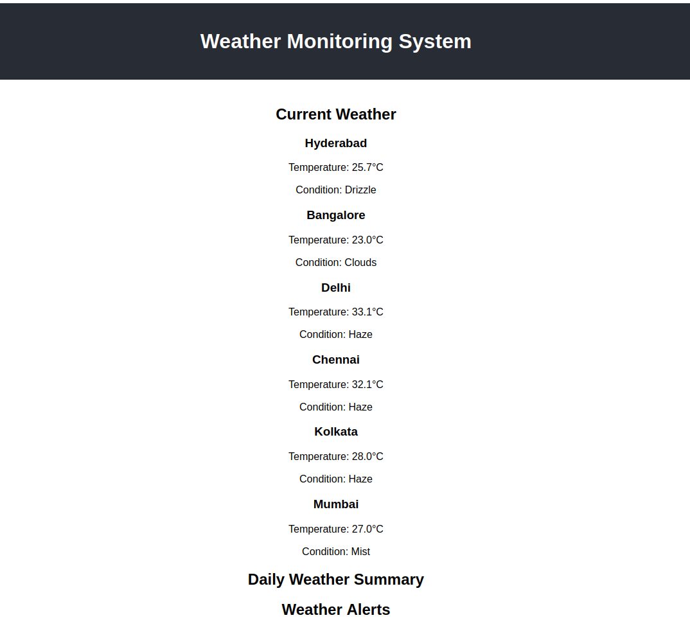

# Real-Time Data Processing System for Weather Monitoring

This project is a real-time data processing system that monitors weather conditions and provides summarized insights using rollups and aggregates. It utilizes data from the OpenWeatherMap API.

## Features

- Continuous retrieval of weather data for major Indian metros
- Daily weather summaries with aggregates
- Alerting system for temperature thresholds
- Visualizations for daily weather summaries and historical trends

## Prerequisites

Before you begin, ensure you have met the following requirements:

- Node.js (v14.0.0 or later)
- npm (v6.0.0 or later)
- MongoDB (v4.0 or later)
- OpenWeatherMap API key

## Installation

1. Clone the repository:

2. Install server dependencies:

3. Install client dependencies:

4. Create a `.env` file in the server directory with the following content:

## Running the Application

1. Start the MongoDB service on your machine.

2. Start the server:
   cd server npm start

3. In a new terminal, start the client:
   cd client npm start

4. Open your browser and navigate to `http://localhost:3000` to use the application.

## Design Choices

1. **MERN Stack**: We chose the MERN (MongoDB, Express.js, React.js, Node.js) stack for its flexibility and JavaScript ecosystem.

2. **Real-time Updates**: The system fetches weather data at configurable intervals to provide near real-time updates.

3. **Daily Summaries**: We generate daily summaries to provide aggregated insights, which are useful for trend analysis.

4. **Alerting System**: The alerting system is designed to be configurable and can be easily extended to include more complex conditions.

5. **Visualization**: We use Chart.js for creating visual representations of the weather data, making it easier for users to understand trends.

6. **Modular Architecture**: The project is structured with separate components and services for better organization and maintainability.

## API Endpoints

- GET `/api/current-weather`: Retrieves the current weather data for all cities
- GET `/api/daily-summary`: Retrieves the daily weather summaries
- GET `/api/alerts`: Retrieves any active weather alerts
